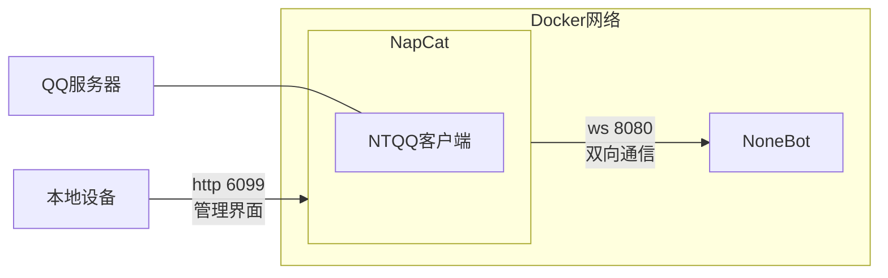

# faq-bot

## How to start

1. generate project using `nb create` .
2. install plugins using `nb plugin install` .
3. run your bot using `nb run` .

## 部署方法

初次部署：

1. 编辑`docker-compose.yml`：

   - 设置 NapCat 容器的环境变量`$ACCOUNT`，指定要登录的 QQ 账号。
   - 设置 NoneBot 容器的环境变量`$ONEBOT_ACCESS_TOKEN`，作为 WebSocket 的 token。

2. 运行`docker-compose up --detach`，启动 NapCat 和 NoneBot。

2. 访问 http://localhost:6099，输入初始密码`napcat`进入管理界面，然后用手机QQ扫码登录QQ账号。

3. 在网络设置页，添加 WebSocket 客户端：

   - URL：`ws://nonebot:8080/onebot/v11/ws`。
   - token：给 NoneBot 设置的 token。

以后部署：

1. 运行`docker-compose up --detach`，启动 NapCat 和 NoneBot。

2. 运行`podman logs --follow --since 10m napcat`，查看日志，然后必要时用手机QQ扫码登录QQ账号。
