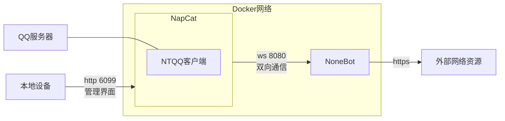

# faq-bot

BIThesis 交流群和 Typst 非官方中文交流群的机器人。

功能：（详见`/help`）

- `/search ⟨关键词⟩…`——搜索 [BIThesis 网站](https://bithesis.bitnp.net)的标题和 URL。

- `/chat ⟨提问内容⟩`——与[北京理工大学智能体广场](https://agent.bit.edu.cn)的“LaTeX-BIThesis帮助”机器人聊天。

- `/tyd ⟨关键词⟩…`——搜索 [Typst 中文社区导航](https://typst-doc-cn.github.io/guide)和[官方文档](https://typst.app/docs)。

- `/univ ⟨package⟩`——预览 [Typst Universe](https://typst.app/universe) 上的包。（需要 Nana 机器人）

- `/ot ⟨名字⟩`——提示讨论已偏离 typst 主题。（需要[安装 typst 基础设施](#安装-typst-基础设施)）

- `/typtyp ⟨文档⟩`——编译 typst 文档。（需要[安装 typst 基础设施](#安装-typst-基础设施)）

宗旨：快速帮助新人学会搜索资料。这个机器人只提供基础功能，是起点而非终点。

## 开发

```shell
cd ./faq-bot
uv run nb run --reload
```

## 相关文档

- [NoneBot | 跨平台 Python 异步机器人框架](https://nonebot.dev/)
- [OneBot 协议适配 - NoneBot](https://onebot.adapters.nonebot.dev/)
- [NapCatQQ | 现代化的基于 NTQQ 的 Bot 协议端实现](https://napneko.github.io/)
- [HiAgent 后端 API 文档](https://github.com/Decent898/live2d-project-for-HCI/blob/dbfd27e3198600f84d50cb32aef68142e6f334fa/api_test/llm_api/v1.5.0-chat_api_doc-v4.pdf)（感谢 Decent898）
- [tinymist-package](https://github.com/Myriad-Dreamin/tinymist/tree/cecb424b1e5f7977d956452380ded46d6dcbda21/crates/tinymist-package)（感谢 Myriad-Dreamin）

## 部署方法



初次部署：

1. 编辑`docker-compose.yml`：

   - 设置 NapCat 容器的环境变量`$ACCOUNT`，指定要登录的 QQ 账号。
   - 设置 NoneBot 容器的环境变量`$ONEBOT_ACCESS_TOKEN`，作为 WebSocket 的 token。
   - 设置 faq-bot 的环境变量，编辑[`.env`](./faq-bot/.env)。

2. 运行`docker-compose up --detach`，启动 NapCat 和 NoneBot。

2. 访问 http://localhost:6099，输入初始密码`napcat`进入管理界面，然后用手机QQ扫码登录QQ账号。

3. 在网络设置页，添加 WebSocket 客户端：

   - URL：`ws://nonebot:8080/onebot/v11/ws`。
   - token：给 NoneBot 设置的 token。

以后部署：

1. 运行`docker-compose up --detach`，启动 NapCat 和 NoneBot。

2. 运行`podman logs --follow --since 10m napcat`，查看日志，然后必要时用手机QQ扫码登录QQ账号。

## 安装 typst 基础设施

如需要`/ot`功能，必须安装 typst 基础设施。

```shell
sudo apt install fonts-noto-cjk
sudo apt install fonts-noto-color-emoji
curl https://github.com/typst/typst/releases/… -o ~/.local/bin/typst
```

然后确认[`docker-compose.yml`](./docker-compose.yml)中挂载的路径无误。
